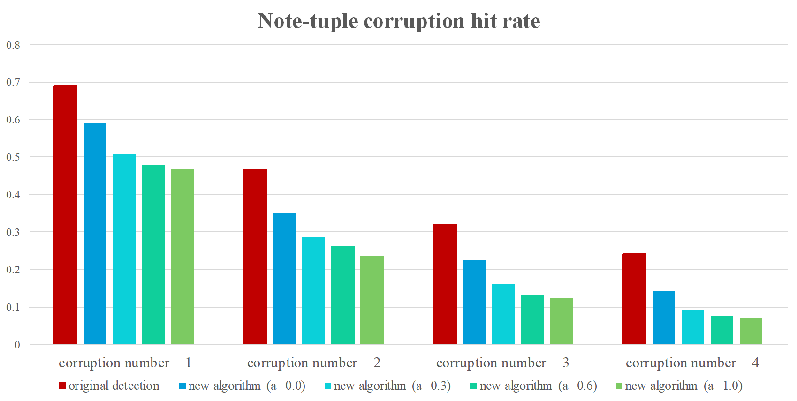

# Chord Representation Model

The chord representation model proposed by Chou et al. has of two main components: a chord detection algorithm to transform monophonic music data into chord sequences, and a PAT-tree for indexing the detected chord sequences.

A monophonic melody $X$ can be represented in a time-ordered sequence of music notes $x_1, x_2, \ldots, x_N$. Each music note $x_i$ has three foundamantal attributes: onset time, pitch and duration. We can represent a music note $x_i$ as a three-value tuple $(onset_i, pitch_i, duration_i)$, called *note-tuple format*.

In chord-representation model, melody $X$ is partition into subsequences $X'_1, \ldots, X'_M$ based on the bar and metre information provided by users. A chord detection algorithm $g$ maps note sequence to a pre-determined collection of chord representations $C$. For a subsequence $X'_j$, its chord representation is $c_j = g(X'_j), c_j \in C$ Perform the algorithm to each of the subsequences, eventually, we will get a sequence of chord representations $c_1, \ldots, c_M$.

## Pitch Class Profile

A pitch class profile (PCP) of a span of music is a vector that encode the occurence fequency of the 12 pitch classes in the span. A pitch class profile $p = (f_1, f_2, \ldots, f_{12})$ where $f_i$ is the occurence frequency of pitch class $i$. For example, a subsequence consist of four notes ((0, A2, 12), (12, G2, 24), (24, A1, 36), (36, C2, 48)) will have PCP (1, 0, 0, 0, 0, 0, 1, 0, 2, 0, 0).

## Original Chord Detection Algorithm

A chord is a musical unit consisting of at least three different pitches. Sometimes, the parititioned subsequences of the melody does not compose of at least three different notes. So the chord detection algorithm have detect the case of two-note interval and single note as well.

The chord detection algorithm in the original paper select 24 chords in their chord representation collect, which are the combination of four common cases with six root pitches (C, D, E, F, G, A). The four cases are:

- Single
- Third
- Triad
- Seventh

The songs are first "normalized" into tonic of C. Then the algorithm will devide the melody into bars, and collect the PCP in each bar. They designed five principles to compare the PCP to each of the 24 chord candidates, and progressively eliminate candidates until only one left.

## New Chord Detection Algorithm

We designed a template-matching based algorithm (Fujishima, 1999) to replace the original algorithm. To be comparable to the original algorithm, we also use 24 chords in the chord representation collection. Due to the nature of tonal system, the case of "interval of third", "triad chord", and "seventh chord" is corresponded to multiple templates. For example, an "interval of third" could actually be a major third or minor third, which are respectivly two notes being 4 semi-tone apart or 3 semi-tone apart. 

The matching score between a PCP $p$ and a given chord $c$ is computed by doing inner product between the $p$ and the hand-crafted weight of the chord $W_c$

$$
\text{score}(W_c, p) = \sum_{i=1}^{12} {W_c}[i] \times p[i]
$$

In order to achieve better detection result, we try to incorporate music key information into detection process. The music information contain two element: *scale* and *tonic*. Because we "normalize" the songs to tonic of C, the tonic is not important. We use four scales: major, natural minor, harmonic minor, melodic minor, each has its hand-crafted weight of the scale $W_{\text{Major}}, W_{\text{NaturalMinor}}, W_{\text{HarmonicMinor}}, W_{\text{MelodicMinor}}$.

We use the PCP of full song to compute the matching score of each weight of scale just like we do between PCP and weight of chord, and select the scale with maximum score as the detected scale of this song. We compute the matching scores between each chord $c$ in chords set $C$ and the detected scale $s$ and use the scores to compute the probabilistoc distribution of chords to scale by softmax function.

$$
P(c | s) = \frac{\exp(\text{score}(W_{c}, W_s)^{\tau})}{\sum_{c' \in C} \exp(\text{score}(W_{c'}, W_s)^{\tau})}
$$

We can call the $P(c | s)$ *scale score*. The $\tau$ in the equation is the "temperature" of the softmax function. To smooth the distribution we use $\tau = 8.0$ in implementation, so that the algorithm won't only choose the chord with highest score.

We will also compute the *bar score*: the probability of each chord $c$ conditioned by the PCP of a bar $p$

$$
P(c | p) = \frac{\exp(\text{score}(W_{c}, p)^{\tau})}{\sum_{c' \in C} \exp(\text{score}(W_{c'}, p)^{\tau})}
$$

Finally we get the final score of a chord $c$ to the PCP of a bar $p$ by

$$
\text{finalScore}(c, p) = P(c | s)^\alpha P(c | p)
$$

The parameter $\alpha$ controls how much $P(c | s)$, the scale score, effects the final score.

# Implementation

## Folksong Records

A folksong record in Essen Folksong database contains following columns:

- Name of its subsection
- Title
- Source: where and how it is recorded
- Signature: An identification string of its melody
- Time unit: The time length of the unit in Jianpu format  
- Tonic: By what value the pitches of melody are normalized in Jianpu format
- Metre: The metre of the song
- Melody: Pitch normalized melody represented in Jianpu format
- Function: In which situation or purpose the tune is used
- Comment
- Lyrics

For simplification, we only keep the necessary columns in ours implementation. These are:

- Name of its subsection
- Title
- Signature
- Time unit
- Tonic
- Metre
- Melody (represented in Jianpu format)
- Melody (represented in note-tuple format)

The key attrbiutes of the folksong table is {Title, Signature}. We pre-process the melody from Jianpu format into note-tuple format for computation convenience. We also create two other table for storing detected musical key and chord sequence of each folksong. 

## Implementation of Chord Detection Algorithm

To implement the chord detection algorithm, we create a function that takes a pitch-normalized note sequence $\bar{x} = \bar{x}_1, \ldots \bar{x}_n$, tonic value $t$ and metre $m$, and outputs detected chord sequence $c = c_1, \ldots, c_m$. The pitch values in $\bar{x}$ will be de-normalized to obtain the original melody $x$.

## Content-Query Method

We implement a query method that support two different melody representation: Jianpu and note-tuple. 

# Experiment

## Effect of Chord Detection Algorithm on Query Precision

If a chord detection algorithm outputs the same chord sequence to many different melody, it could have better tolerence to user's input fault, but be bad at its primary task: indexing. To know which chord detection algorithm can give better search result, we use *average precision* to show how often is more then one melody having the same detected chord sequence. 

The precision of a query result is the number of related items divided by number of retrieved items. In this indexing senario, the number of related item is always one. So for each query result, the precision is one over number of retrieved items. And the average precision is

$$
\frac{1}{N} \sum_{i=1}^N \frac{1}{|Q(i)|} 
$$

where $|Q(i)|$ is the number of retrieved songs when using the melody of the $i$-th song as the query, and $N$ is the number of songs in the database.

## Simulation of User Input Fault

### Simulation of User Input Fault in Jianpu Representation

### Simulation of User Input Fault in Note-tuple Sequence Representation

## Configuration

We use four configurations of database: one with original chord detection algorithm, and three with our proposed algorithm with the key-chord score weight $\alpha$ being $0.0, 0.3, 0.6 1.0$. 

## Result

### Result of Query Precision

### Result of User Input Fault in Jianpu Representation

### Result of User Input Fault in Note-tuple Sequence Representation

