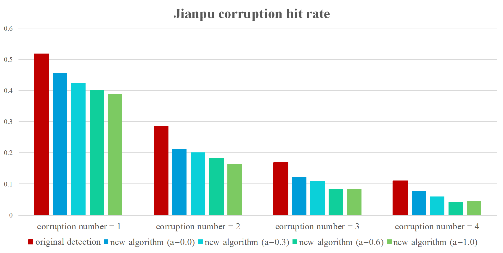

# Introduction

For music databases, along with other databases of media content, have a major issue of processing
content-based retrieval. A content-based music retrieval system should allow users to search by
a segment of music that starts from any point of the target music, and be able to tolerance user's
input fault.

To satisfy these two requirements, Chou et al. (1996) [1] proposed *chord-representation model*
that represent the music themes as sequences of chords. This method transforms
music indexing into something like searching a string over many documents, which can be efficiently
achieved by using PAT-tree structure. They designed a chord detection algorithm to transform
monophonic music into sequence of predefined set of chords, but there is no experiment on the matter.

We tried to apply newer chord detection algorithm to the chord-represention model. Fujishima (1999)
[2] proposed a method for chord detection from musical sound. This method
is now a base of more recent researches [3]. They first extract *pitch-class profile* (PCP) from a
section of music audio seuqence by discrete Fourier transform (DFT), then determine the chords of a
PCP the matching score between it and the *chord type templates* (CTTs).

However, when applying Fujishima's template-matching method onto monophonic melody, due to the lack
of context and overlaying notes, a problem emerges that there are too many equally possible chords
to pick in the CTTs. To solve this problem, we provide more context by incooperating music keys
information into detection process, utilizing the fact that more chords are considered "out of key"
then not.

The detection of music key can be achieved by first compute the PCP of the full melody and determine
its scale and tonic by its distribution [4]. After recognizing the music key of a monophonic
melody, we calculate a matching score between all possible chords and the recognized key by matching
all the CTTs with the *key type template* (KTT) of the recognized key in the similar fashion of
matching PCP and CTTs. The detection result then is determined by two different matching scores: ones
between the PCP and CTTs, and the other ones between CCTs and KTTs.

Chou et al. claim that chords representations are excellent at tolerating the user's input faults,
but didn't do the experiment on the matter. So in this project, we designed a experiment to see how
well the model tolerate user's fault and how different chord detection algorithms effect the result.
The input fault tolerance is evalauated by the hit-rate of the model when feeding with corrupted
query. The experiment was performed on the 6,008 public domain songs from Essen Folksong Collection
\cite{schaffrath1995essen}.

Our result shows that the algorithm provided in the original paper did have higher tolerance than the
PCP-matching base algorithm, but it also have lower indexing precision. It seems reason considering
that the ability of input tolerance comes from not being able to differentiate two very similar music.

# Model Design

## Chord Representation Model

The chord representation model proposed by Chou et al. has of two main components: a chord detection
algorithm to transform monophonic music data into chord sequences, and a PAT-tree for indexing the
detected chord sequences.

A monophonic melody $X$ can be represented in a time-ordered sequence of music notes
$x_1, x_2, \ldots, x_N$. Each music note $x_i$ has three fundamental attributes: onset time, pitch
and duration. We can represent a music note $x_i$ as a three-value tuple $(o_i, p_i, d_i)$, called
*note-tuple format*.

In chord-representation model, melody $X$ is partition into subsequences $X'_1, \ldots, X'_M$ based
on the bar and metre information provided by users. A chord detection algorithm $g$ maps note
sequence to a pre-determined collection of chord representations $C$. For a subsequence $X'_j$, its
chord representation is $c_j = g(X'_j), c_j \in C$ Perform the algorithm to each of the subsequences,
eventually, we will get a sequence of chord representations $c_1, \ldots, c_M$.

## Pitch Class Profile

A pitch class profile (PCP) of a music section is a vector that encode the occurrence frequency of
the 12 pitch classes in the section. A pitch class profile $p = (f_1, f_2, \ldots, f_{12})$ where
$f_i$ is the occurence frequency of pitch class $i$. For example, a subsequence consist of four
notes `(1, E0, 1), (2, G0, 1), (3, G-1, 1), (4, C0, 4)` will have PCP
`(4, 0, 0, 0, 1, 0, 0, 2, 0, 0, 0, 0)`

## Original Chord Detection Algorithm

A chord is a musical unit consisting of at least three different pitches. Sometimes, the parititioned
subsequences of the melody does not compose of at least three different notes. So the chord detection
algorithm for monophonic melody have to detect the case of two-note interval and single note as well.

The chord detection algorithm in the original paper select 24 chords in their chord representation
collection, which are the combination of four common cases with six root pitches C, D, E, F, G, A.
The four cases are:

- Single
- Interval of third
- Triad
- Seventh

The songs are first "normalized" into tonic of C. Then the algorithm will divide the melody into
bars, and collect the PCP in each bar. They designed five principles to compare the PCP to each of
the 24 chord candidates, and progressively eliminate candidates until only one left.

## New Chord Detection Algorithm

We designed a template-matching based algorithm to replace the original algorithm. To be comparable
to the original algorithm, we also use 24 chords in the chord representation collection. Due to the
nature of tonal system, the case of "interval of third", "triad chord", and "seventh chord" is
corresponded to multiple templates. For example, an "interval of third" could actually be a major
third or minor third, which are respectively two notes being 4 semi-tone apart or 3 semi-tone apart. 

The matching score between a PCP $p$ and a given chord $c$ is calculated as doing inner product
between the $p$ and every hand-crafted template weight of the chord $W_{c,k}, k = 1 \ldots n_c$, and
$n_c$ is the number of template the chord $c$ corresponded to.

$$
\text{score}(p, c) = \max_k \left(\sum_{i=1}^{12} {W_{c,k}}[i] \times p[i] \right)
$$

In order to achieve better detection result, we try to incorporate music key information into
detection process. The music key information contain two element: *scale* and *tonic*. We use four
scales: major, natural minor, harmonic minor, melodic minor, and all 12 pitches as tonics. The hand-
crafted weight of the music key with scale $s$ and tonic $t$ is denoted as $W_{\langle s,t \rangle}$.

To detect the music key $\langle s, t \rangle$ of a melody, we use the PCP of full melody to compute
the matching score of each weight of key just like we do between PCP and weight of chord, and select
the key with maximum score as the detected key of this melody.

$$
s^*, t^* = argmax_{s,t} \left( score(\langle s, t \rangle, p_{full}) \right)
$$

We compute the matching scores between each chord $c$ in chords set $C$ and the detected key
$\langle s^*,t^* \rangle$ and use the scores to compute the probabilistic distribution of chords to
key with softmax function.

$$
P(c|\langle s^*,t^* \rangle)
 = \frac{e^{\text{score}(c, \langle s^*,t^* \rangle) / \tau}}
        {\sum_{c' \in C} e^{\text{score}(c', \langle s^*,t^* \rangle) / \tau}}
$$

We can call the $P(c|\langle s^*,t^* \rangle)$ *key score*. The $\tau$ in the equation is the
"temperature" of the softmax function. To smooth the distribution we use $\tau = 8.0$ in
implementation, so that the algorithm won't only choose the chord with highest score.

We will also compute the *bar score*:
the probability of each chord $c$ conditioned by the PCP of a bar $p$

$$
P(c | p) = \frac{e^{\text{score}(c, p) / \tau}}{\sum_{c' \in C} e^{\text{score}(c', p) / \tau}}
$$

Finally we get the final score of a chord $c$ to the PCP of a bar $p$ by

$$
\text{finalScore}(c, p) = P(c|\langle s^*,t^* \rangle)^a P(c|p)
$$

The parameter $a$ controls how much $P(c|\langle s^*,t^* \rangle)$, the key score, effects the final
score.

# Implementation

## Folksong Records

A folksong record in Essen Folksong database contains following columns:

- Name of its subsection
- Title
- Source: where and how it is recorded
- Signature: An identification string of its melody
- Time unit: The time length of the unit in Jianpu format  
- Tonic: By what value the pitches of melody are normalized in Jianpu format
- Metre: The metre of the song
- Melody: Pitch normalized melody represented in Jianpu format
- Function: In which situation or purpose the tune is used
- Comment
- Lyrics

For simplification, we only keep the necessary columns in ours implementation. These are:

- Name of its subsection
- Title
- Signature
- Time unit
- Tonic
- Metre
- Melody (represented in Jianpu format)
- Melody (pre-processed to note-tuple format)

The key attrbiutes of the folksong table is {Title, Signature}. We pre-process the melody from Jianpu
format into note-tuple format for computation convenience. We also create two other table for storing
detected musical key and chord sequence of each folksong. 

## Implementation of Chord Detection Algorithms

To implement the chord detection algorithms, we create a function that takes a pitch-normalized note
sequence $\bar{x} = \bar{x}_1, \ldots \bar{x}_n$, tonic value $t$ and metre $m$, and outputs detected
chord sequence $c = c_1, \ldots, c_m$.

When the function is in the new algorithm mode, before executing the new algorithm, the pitch values
in $\bar{x}$ will be de-normalized to obtain the original melody $x$. And when the function is in the
original algorithm mode, before executing the original algorithm, to normalized the key to the tonic
of C, we perform the key detection used in new chord detection algorithm to first know the key tonic
of song, then shift the pitch of notes such the pitch of tonic notes become C.

## Content-Query Method

We implement a query method that allow user to input in two different melody representations: Jianpu
and note-tuple.

# Experiment

## Effect of Chord Detection Algorithm on Query Precision

If a chord detection algorithm outputs the same chord sequence to many different melody, it could
have better tolerance to user's input fault, but be less efficient at its primary task: indexing. To
know which chord detection algorithm can give better search result, we use *average precision* to show
how often is more then one melody having the same detected chord sequence. 

The precision of a query result is the number of related items divided by number of retrieved items.
In this indexing senario, the number of related item is always one. So for each query result, the
precision is one over number of retrieved items. And the average precision is

$$
\frac{1}{N} \sum_{i=1}^N \frac{1}{|Q(i)|} 
$$

where $|Q(i)|$ is the number of retrieved records when using the melody of the $i$-th song as the
query, and $N$ is the number of songs in the database.

## Simulation of User's Input Fault

We simulate user's input fault by "corrupting" the original melody representation. We design two ways
to "corrupt" a melody representation: *deletion* and *update*. Deletion is defined as randomly picking
a component of the representation and removing it. While *update* is defined as randomly picking a
component of the representation, and replacing it with a random component.

Each "corruption" has half the chance to be deletion and the other half to be *update*.

### Simulation of User's Input Fault in Jianpu Format

The basic component of Jianpu format is characters, so the deletion and update are define as:

- Deletion: randomly pick a character and remove it
- Update: randomly pick a character and replace it with a random character in Jianpu’s charater set

If a corruption make the format invalid, then it is revoked and we try again until the format is
valid and the new content is not the same as the original content.

### Simulation of User's Input Fault in Note-tuple Sequence Format

The basic component of note-tuple format is, of course, note-tuple, so the deletion and update are
define as:

- Deletion: randomly pick a note-tuple and remove it
- Update: randomly pick a note-tuple and replace it's **pitch value** with a random value within one
  positive octave and one negative octave

The reason we don’t update the onset and duration value of note-tuple is because it has very high
possibility to be invalid if replacing it with random value.

## Configuration

We use five configurations of database: one with original chord detection algorithm, and four with
our proposed algorithm with the key-chord score weight $\alpha$ being $0.0, 0.3, 0.6, 1.0$.

For each database, we examine its average query precision and its tolerance to user’s input fault by
doing 1~4 corruption to each of the melody in Jianpu and note-tuple format.

## Result

### Result of Query Precision

### Result of User Input Fault in Jianpu Representation

### Result of User Input Fault in Note-tuple Sequence Representation

## Discussion

- The new chord detection algorithm we designed has better query precision than the original one, but
  lower tolerance to input fault.

- The incorporation of music key information can increase the query precision.

- The query precision and the tolerance to input fault may have negative relationship, probably due to
  their contradicting purpose.

# References

[1] T.-C. Chou, A. L. Chen, and C.-C. Liu, “Music databases: indexing techniques and implementation,”
in Proceedings of International Workshop on Multimedia Database Management Systems. IEEE, 1996,
pp. 46–53.

[2] T. Fijishima, “Realtime chord recognition of musical sound: A system using common lisp,” in
Proceedings of the International Computer Music Conference. ICMC, 1999, pp. 464–467

[3] J. Pauwels, K. O’Hanlon1, E. G ́omez, and M. B. Sandler, “20 years of automatic chord recognition
from audio,” in Proceedings of the 20th International Society for Music Information Retrieval 
Conference. ISMIR, 2019, pp. 54–63.

[4] Y. Zhu, M. Kankanhalli, and S. Gao, “Music key detection for musical audio,” in 11th
International Multimedia Modelling Conference, 2005, pp. 30–37